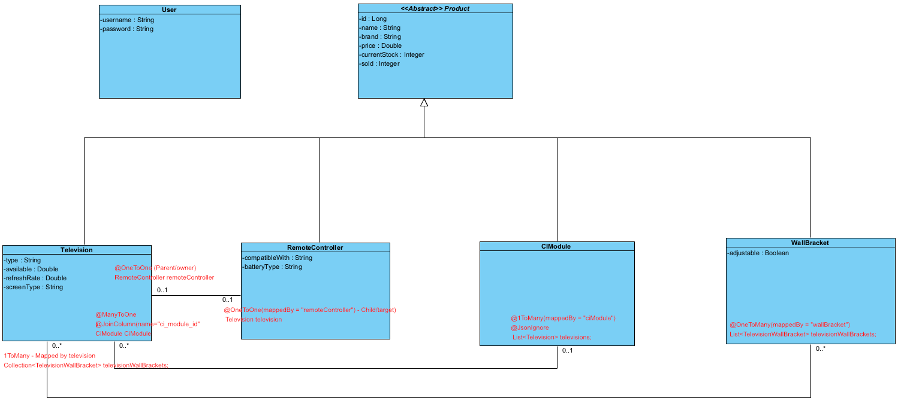

# Opdrachtbeschrijving

## Inleiding

Je bent net begonnen als developer bij een bedrijf dat TV's verkoopt: Tech It Easy. Tijdens de cursus Spring Boot ga jij een backend applicatie programmeren voor het bedrijf. De winkel heeft een inventaris van televisies die moet worden bijgehouden. Na iedere les gaan we deze applicatie een stukje verder uitbouwen door middel van de huiswerkopdrachten. Zo krijg je stap-voor-stap meer ervaring in het bouwen van een backend applicatie. Aan het einde van de cursus zullen we een werkende Tech It Easy backend applicatie hebben!

## Recap van vorige opdracht

Je hebt inmiddels je applicatie draaiende gekregen. Dit geeft je de mogelijkheid om in een database bij te houden welke tv's er zijn in de inventaris van TechItEasy. Als je de benamingen hebt aangehouden die we tot nu toe hebben gebruikt, kunnen we een _data.sql_ gaan maken waardoor we gegevens in de database kunnen zetten. Dit is een soort van pre-fill van je database.

## Opdrachtbeschrijving
In deze opdracht ga je aan de slag met het toevoegen van relaties aan je applicatie.

## Randvoorwaarden
De opdracht moet voldoen aan de volgende voorwaarden:

Het project bevat de volgende `Models`:
- `Television`
- `RemoteController` met de _variables_:
  -_Long_`id`
  -_String_`compatibleWith`
  -_String_`batteryType`
  -_String_`name`
  -_String_`brand`
  -_Double_ `price`
  -_Integer_ `originalStock`
- `CI-Module` met de _variables_:
  -_Long_ `id`
  -_String_ `name`
  -_String_ `type`
  -_Double_ `price`
- `WallBracket` met de _variables_:
  -_Long_ `id`
  -_String_ `size`
  -_Boolean_ `ajustable`
  -_String_ `name`
  -_Double_ `price`
  Voor elk van deze modellen bevat je applicatie ook een `Repository`, `Controller`, `Dto`, `InputDto` en een `Service`.

Daarnaast bevat het project:
- Een `OneToOne` relatie tussen `Television` en `RemoteController`
- Een `OneToMany` relatie tussen `Television` en `CI-Module`
- Een `ManyToMany` relatie tussen `Television`en `WallBracket`

### Belangrijk
Je mag de constructors uit de modellen weglaten. Deze vult Spring Boot automatisch in als ze niet gedefinieerd zijn. Ook uit de `Television` mogen de constructors verwijderd worden.

## Stappenplan
_Let op_: het is uitdagender om jouw eigen stappenplan te maken. Mocht je niet zo goed weten waar je moet beginnen, kun je onderstaand stappenplan volgen:

1. Maak in de map `Models` een _klasse_ aan voor `RemoteController`, `CI-Module` en `WallBracket` (voeg de juiste _annotatie_, _variables_, _getters&setters_ en _constructors_ toe).
2. Maak in de map `Repositories` voor elk model een `Repository` aan (die elk de `JpaRepository` _extends_ bevat).
3. Maak in de map `Controllers` voor elk model een `Controller` aan (met juiste _annotatie_, _@Autowired_ en _requestMappings_).
4. Maak in de map `Dtos` voor elk model een `Dto` en `InputDto` aan (met juiste _variables_ en toewijzingen).
5. Maak in de map `Services` voor elk model een `Service` aan (met juiste _annotatie_, _@Autowired_ en _functions_).
6. Leg een OneToOne relatie tussen `Television` en `RemoteController` door in beide _models_ _@OneToOne_ toe te voegen, gevolgd door het model waar de relatie mee ligt in de vorm van `Model` `object` (bijvoorbeeld `Television` `television`) op de volgende regel.
7. Een OneToOne relatie heeft een eigenaar nodig. Maak de `Television` eigenaar door in `RemoteController` achter de _@OneToOne_ _mappedBy_ toe te voegen op deze manier _@OneToOne(mappedBy = "remotecontroller"). Dit zorgt ervoor dat in de `Television` tabel een kolom wordt toegevoegd met de naam `remotecontroller_id`. Vergeet niet de getter en setter toe te voegen na het leggen van de relatie in de modellen.
8. Om deze kolom te vullen zal je in _servicelaag_ ook een functie moeten maken die een koppeling maakt tussen de `Television` en de `RemoteController`. Dit doe je in de `TelevisionService`.
9. Voeg de functie "assignRemoteControllerToTelevision" toe in de `TelevisionService`. Zoals je ziet, herkent de `TelevisionService` de `RemoteControllerRepository` niet, dit komt omdat we deze nog niet gekoppeld hebben met een _@Autowired_, gelukkig hoef je niet alles opnieuw te doen. Je kan bovenaan in de `TelevisionService` onder de private `TelevisionRepository` een private `RemoteControllerRepository` declareren. En dan in de bestaande _@Autowired_ deze toevoegen op dezelfde manier als de `TelevisionRepository`. Dit resulteert in:
   `@Autowired
   public TelevisionService (TelevisionRepository televisionRepository, RemoteControllerRepository remoteControllerRepository) {
   this.televisionRepository = televisionRepository;
   this.remoteControllerRepository = remoteControllerRepository;}`
10. Om deze functie uit te kunnen voeren moet je in de `TelevisionController` een _PutRequest_ maken met endpoint _"/televisions/{id}/remotecontroller"_ om aan te spreken. Voeg deze toe en geef de _televisionId_ mee als _@PathVariable_ en de _remoteControllerId_ als _@RequestBody_ door middel van een `IdInputDto` _input_.
11. Hiervoor missen we nog de `IdInputDto`. Maak in het mapje `Dtos` een nieuwe klasse aan voor de `IdInputDto`. Declareer in deze dto een _public Long id_ toe, meer hoeft er niet in.
12. Gefeliciteerd, je hebt zo juist de eerste relatie gelegd in je applicatie!
13. Alleen als je nu met een get alle `Televisions` ophaalt, zie je geen `RemoteController`. Dit komt omdat we in de `TelevisionDto` nog niks hebben verteld over de `RemoteController`. De makkelijkste manier om hier de connectie te leggen is de `public RemoteControllerDto remoteController;` toe te voegen aan de variabele van de `TelevisionDto`
14. Test alle functies die je tot nu toe hebt gemaakt met Postman.

## Bonusopdrachten
In deze opdracht heb ik een relatie uitgelegd aan de hand van het stappenplan. Als je hier makkelijk doorheen gaat, mag je ook de _one to many_ relatie maken tussen `Television` en `CIModule`. Hierbij is het nodig dat meerdere tv's één ci-module kunnen hebben.
Als zelfs de _one to many_ redelijk eenvoudig voor je is, mag je een _many to many_ relatie leggen tussen `Television` en `WallBracket`. Dus meerdere tv's kunnen meerdere wallbrackets hebben en andersom.
